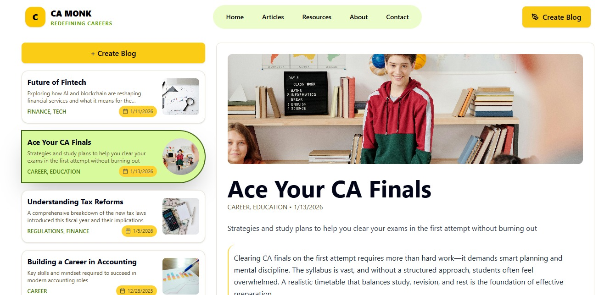
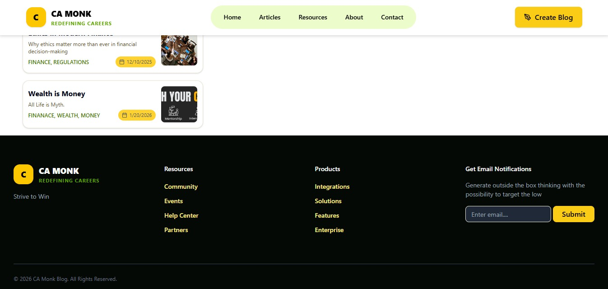
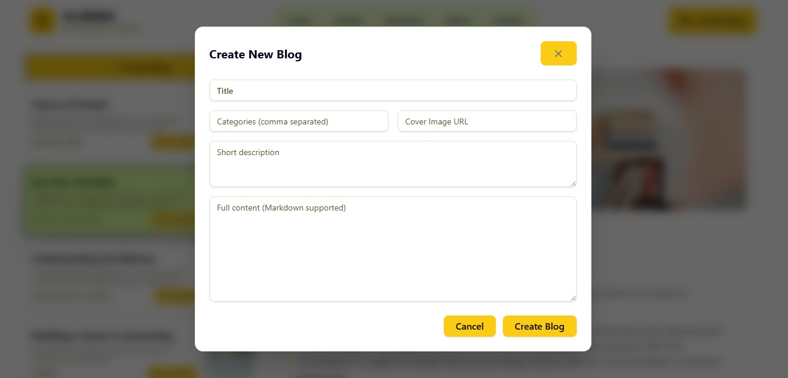

# 📝 CA MONK – Blog Management Application

A modern, responsive **Blog Management System** built using **React + TypeScript**, featuring blog creation, listing, detailed view, and deletion with a clean UI and real-world deployment setup.

---

## 🚀 Live Demo

- **Frontend (Vercel):** https://your-frontend-url.vercel.app  
- **Backend (Render):** your-backend-url

---

## ✨ Features

- 📚 View all blogs in a clean list layout
- 🖼️ Blog cards with cover image preview
- 🔍 Detailed blog view with full content
- ✍️ Create new blogs using a modal form
- 🗑️ Delete blogs with confirmation
- ⚡ Fast, responsive UI
- 🌐 Environment-based API configuration
- 🔔 Toast notifications using Sonner

---

## 🛠️ Tech Stack

### Frontend
- **React + TypeScript**
- **Vite**
- **Tailwind CSS**
- **shadcn/ui**
- **TanStack Query**
- **Lucide Icons**
- **Sonner (Toast notifications)**

### Backend
- **json-server**
- **Node.js**
- **CORS**
- **REST API**

### Deployment
- **Frontend:** Vercel
- **Backend:** Render

---

## 📁 Project Structure

```bash
# Project Structure

```text
Frontend-Interview/
├── public/
├── server/
│   ├── node_modules/
│   ├── .gitignore
│   ├── db.json
│   ├── package-lock.json
│   ├── package.json
│   └── server.js
├── src/
│   ├── api/
│   │   └── blogs.ts
│   ├── assets/
│   │   └── react.svg
│   ├── components/
│   │   ├── blog/
│   │   │   ├── BlogCard.tsx
│   │   │   ├── BlogDetail.tsx
│   │   │   ├── BlogDetailSkeleton.tsx
│   │   │   ├── BlogList.tsx
│   │   │   ├── BlogSkeleton.tsx
│   │   │   ├── CreateBlogForm.tsx
│   │   │   └── FooterSection.tsx
│   │   ├── ui/
│   │   ├── BlogDetail.jsx
│   │   ├── ErrorBoundary.tsx
│   │   └── Navbar.tsx
│   ├── hooks/
│   │   ├── use-toast.ts
│   │   ├── useBlogById.ts
│   │   ├── useBlogs.ts
│   │   ├── useCreateBlog.ts
│   │   └── useDeleteBlog.ts
│   ├── lib/
│   │   ├── queryClient.ts
│   │   └── utils.ts
│   ├── pages/
│   │   └── BlogPage.tsx
│   ├── types/
│   │   └── blog.ts
│   ├── App.css
│   ├── App.tsx
│   ├── index.css
│   └── main.tsx
├── .env
├── .gitignore
├── components.json
├── eslint.config.js
├── index.html
├── package-lock.json
├── package.json
├── postcss.config.js
├── tailwind.config.js
├── tsconfig.app.json
├── tsconfig.json
├── tsconfig.node.json
└── vite.config.ts


---

## 🛠️ UI

### Main Page
  

### End Page
  

### Create Blog Form
  


